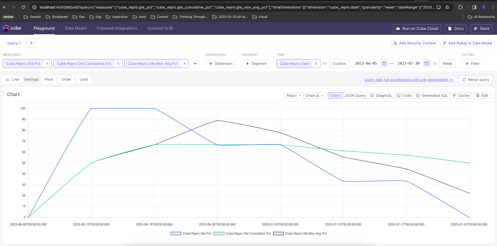
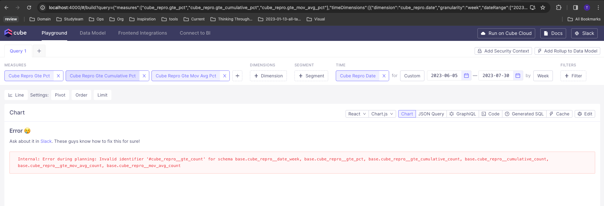
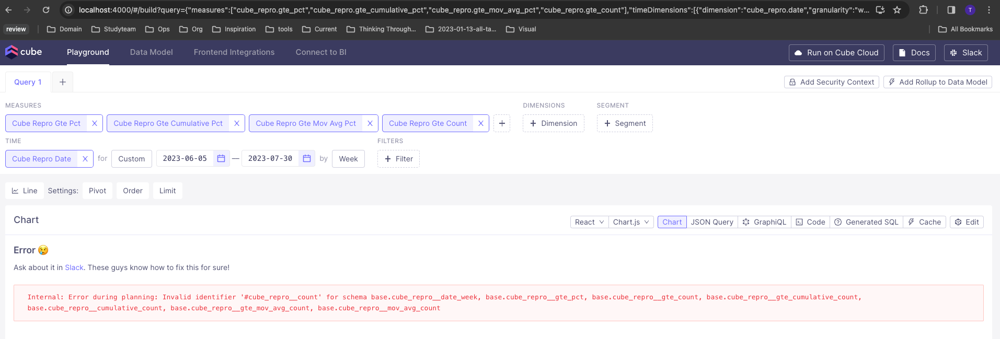
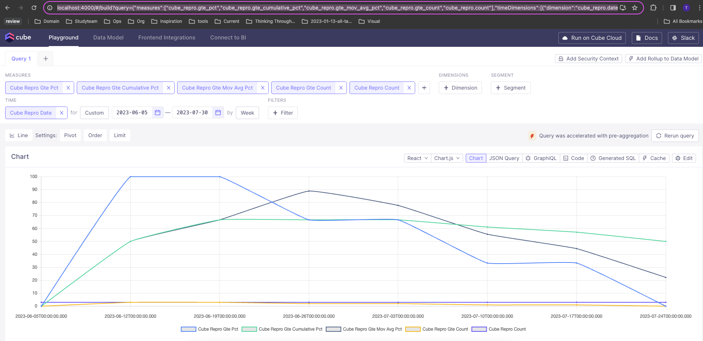

# Steps to reproduce

- [x] Create table in redshift

```shell
CREATE TABLE cube_repro (
    id integer PRIMARY KEY,
    value double precision,
    date date
);
```

- [x] Insert sample data
  - NOTE: 175 is a special number for this data, used to categorize data as a threshold. Values less than 175 are `ltThreshold`, greater than or equal to 175 are `gteThreshold`.
  - The goal is to have a week-over-week line chart that calculates over the current week, cumulative, and 3-week moving average windows

```sql
INSERT INTO cube_repro (id, value, date) VALUES
(1,174,'2023-06-05'),
(2,174,'2023-06-05'),
(3,174,'2023-06-05'),
(4,175,'2023-06-12'),
(5,175,'2023-06-12'),
(6,175,'2023-06-12'),
(7,175,'2023-06-19'),
(8,175,'2023-06-19'),
(9,175,'2023-06-19'),
(10,175,'2023-06-26'),
(11,175,'2023-06-26'),
(12,174,'2023-06-26'),
(13,175,'2023-07-03'),
(14,175,'2023-07-03'),
(15,174,'2023-07-03'),
(16,175,'2023-07-10'),
(17,174,'2023-07-10'),
(18,174,'2023-07-10'),
(19,175,'2023-07-17'),
(20,174,'2023-07-17'),
(21,174,'2023-07-17'),
(22,174,'2023-07-24'),
(23,174,'2023-07-24'),
(24,174,'2023-07-24');
```

- [x] Setup a sample project
  - Used https://cube.dev/docs/product/getting-started/core/create-a-project to get started

```shell
mkdir cubejs-pre-agg-issue-example
cd cubejs-pre-agg-issue-example
touch docker-compose.yml
```

- [x] Update docker-compose.yml to connect to redshift
- [x] Create sample.env to load env vars to connect to redshift
  - NOTE: This was left with placeholders that need to be configured to actually connect to something...
- [x] Source env vars, so they are available when running docker compose

```shell
source sample.env
```

- [x] Use docker-compose to launch the playground

```shell
docker-compose up
```

- [x] Use playground to create `schema/cubes/cube_repro.js`
- [x] Update `schema/cubes/cube_repro.js` to include the measures
  - NOTE: We create count measures, and then some calculated window measures. Finally we create some calculated measures on the windowed measures, ultimately trying to report on percent measures (Pct)
- [x] Use playground to query data
  - NOTE: This query just refers to the Percent (Pct) Measures, and it works as expected

```shell
http://localhost:4000/#/build?query={%22measures%22:[%22cube_repro.gte_pct%22,%22cube_repro.gte_cumulative_pct%22,%22cube_repro.gte_mov_avg_pct%22],%22timeDimensions%22:[{%22dimension%22:%22cube_repro.date%22,%22granularity%22:%22week%22,%22dateRange%22:[%222023-06-05%22,%222023-07-30T23:59:59.999%22]}],%22order%22:{%22cube_repro.date%22:%22asc%22}}
```



- [x] Use playground to suggest pre-aggregation

```shell
main: {
  measures: [
    cube_repro.gte_count,
    cube_repro.count,
    cube_repro.gte_cumulative_count,
    cube_repro.cumulative_count,
    cube_repro.gte_mov_avg_count,
    cube_repro.mov_avg_count
  ],
  timeDimension: cube_repro.date,
  granularity: `week`
}
```

- [x] Update cube_repro cube model to contain the pre-aggregation
- [x] Use playground to attempt to use the suggested pre-aggregation, witness failure, reporting `cube_repro__gte_count`.



```shell
Internal: Error during planning: Invalid identifier '#cube_repro__gte_count' for schema base.cube_repro__date_week, base.cube_repro__gte_pct, base.cube_repro__gte_cumulative_count, base.cube_repro__cumulative_count, base.cube_repro__gte_mov_avg_count, base.cube_repro__mov_avg_count
```

- [x] Capture the generated sql. Note that measures are referenced in the outer query that are not made available by the inner query...

```sql
SELECT
  `cube_repro__date_week`,
  100.0 * sum(
    CASE
      WHEN `cube_repro__date_week` >= to_timestamp(?)
      AND `cube_repro__date_week` <= to_timestamp(?) THEN `cube_repro__gte_count`
    END
  ) / sum(
    CASE
      WHEN `cube_repro__date_week` >= to_timestamp(?)
      AND `cube_repro__date_week` <= to_timestamp(?) THEN `cube_repro__count`
    END
  ) `cube_repro__gte_pct`,
  100.0 * ROLLING(
    sum(`cube_repro__gte_cumulative_count`) RANGE UNBOUNDED PRECEDING OFFSET
  end
) / ROLLING(
  sum(`cube_repro__cumulative_count`) RANGE UNBOUNDED PRECEDING OFFSET
end
) `cube_repro__gte_cumulative_pct`,
100.0 * ROLLING(
  sum(`cube_repro__gte_mov_avg_count`) RANGE INTERVAL '3 week' PRECEDING OFFSET
end
) / ROLLING(
  sum(`cube_repro__mov_avg_count`) RANGE INTERVAL '3 week' PRECEDING OFFSET
end
) `cube_repro__gte_mov_avg_pct`
FROM
  (
    SELECT
      `cube_repro__date_week` `cube_repro__date_week`,
      100.0 * sum(`cube_repro__gte_count`) / sum(`cube_repro__count`) `cube_repro__gte_pct`,
      sum(`cube_repro__gte_cumulative_count`) `cube_repro__gte_cumulative_count`,
      sum(`cube_repro__cumulative_count`) `cube_repro__cumulative_count`,
      sum(`cube_repro__gte_mov_avg_count`) `cube_repro__gte_mov_avg_count`,
      sum(`cube_repro__mov_avg_count`) `cube_repro__mov_avg_count`
    FROM
      cubestore_pre_aggregations_tomjkidd.cube_repro_main AS `cube_repro__main`
    WHERE
      (`cube_repro__date_week` <= to_timestamp(?))
    GROUP BY
      1
  ) `base` ROLLING_WINDOW DIMENSION `cube_repro__date_week`
GROUP BY
  DIMENSION `cube_repro__date_week`
FROM
  date_trunc('week', to_timestamp(?)) TO date_trunc('week', to_timestamp(?)) EVERY INTERVAL '1 week'
```

- [x] Add `cube_repro__gte_count` to the query, and re-attempt

```shell
http://localhost:4000/#/build?query={%22measures%22:[%22cube_repro.gte_pct%22,%22cube_repro.gte_cumulative_pct%22,%22cube_repro.gte_mov_avg_pct%22,%22cube_repro.gte_count%22],%22timeDimensions%22:[{%22dimension%22:%22cube_repro.date%22,%22granularity%22:%22week%22,%22dateRange%22:[%222023-06-05%22,%222023-07-30T23:59:59.999%22]}],%22order%22:{%22cube_repro.date%22:%22asc%22}}
```

- [x] Witness new error, reporting `cube_repro__count` isn't valid



```shell
Internal: Error during planning: Invalid identifier '#cube_repro__count' for schema base.cube_repro__date_week, base.cube_repro__gte_pct, base.cube_repro__gte_count, base.cube_repro__gte_cumulative_count, base.cube_repro__cumulative_count, base.cube_repro__gte_mov_avg_count, base.cube_repro__mov_avg_count
```

- [x] Capture generated sql. Note again that measures are referenced in the outer query that are not made available by the inner query...

```sql
SELECT
  `cube_repro__date_week`,
  100.0 * sum(
    CASE
      WHEN `cube_repro__date_week` >= to_timestamp(?)
      AND `cube_repro__date_week` <= to_timestamp(?) THEN `cube_repro__gte_count`
    END
  ) / sum(
    CASE
      WHEN `cube_repro__date_week` >= to_timestamp(?)
      AND `cube_repro__date_week` <= to_timestamp(?) THEN `cube_repro__count`
    END
  ) `cube_repro__gte_pct`,
  100.0 * ROLLING(
    sum(`cube_repro__gte_cumulative_count`) RANGE UNBOUNDED PRECEDING OFFSET
  end
) / ROLLING(
  sum(`cube_repro__cumulative_count`) RANGE UNBOUNDED PRECEDING OFFSET
end
) `cube_repro__gte_cumulative_pct`,
100.0 * ROLLING(
  sum(`cube_repro__gte_mov_avg_count`) RANGE INTERVAL '3 week' PRECEDING OFFSET
end
) / ROLLING(
  sum(`cube_repro__mov_avg_count`) RANGE INTERVAL '3 week' PRECEDING OFFSET
end
) `cube_repro__gte_mov_avg_pct`,
sum(
  CASE
    WHEN `cube_repro__date_week` >= to_timestamp(?)
    AND `cube_repro__date_week` <= to_timestamp(?) THEN `cube_repro__gte_count`
  END
) `cube_repro__gte_count`
FROM
  (
    SELECT
      `cube_repro__date_week` `cube_repro__date_week`,
      100.0 * sum(`cube_repro__gte_count`) / sum(`cube_repro__count`) `cube_repro__gte_pct`,
      sum(`cube_repro__gte_count`) `cube_repro__gte_count`,
      sum(`cube_repro__gte_cumulative_count`) `cube_repro__gte_cumulative_count`,
      sum(`cube_repro__cumulative_count`) `cube_repro__cumulative_count`,
      sum(`cube_repro__gte_mov_avg_count`) `cube_repro__gte_mov_avg_count`,
      sum(`cube_repro__mov_avg_count`) `cube_repro__mov_avg_count`
    FROM
      cubestore_pre_aggregations_tomjkidd.cube_repro_main AS `cube_repro__main`
    WHERE
      (`cube_repro__date_week` <= to_timestamp(?))
    GROUP BY
      1
  ) `base` ROLLING_WINDOW DIMENSION `cube_repro__date_week`
GROUP BY
  DIMENSION `cube_repro__date_week`
FROM
  date_trunc('week', to_timestamp(?)) TO date_trunc('week', to_timestamp(?)) EVERY INTERVAL '1 week'
```

- [x] Add `cube_repro__count` to the query, and re-attempt

```shell
http://localhost:4000/#/build?query={%22measures%22:[%22cube_repro.gte_pct%22,%22cube_repro.gte_cumulative_pct%22,%22cube_repro.gte_mov_avg_pct%22,%22cube_repro.gte_count%22,%22cube_repro.count%22],%22timeDimensions%22:[{%22dimension%22:%22cube_repro.date%22,%22granularity%22:%22week%22,%22dateRange%22:[%222023-06-05%22,%222023-07-30T23:59:59.999%22]}],%22order%22:{%22cube_repro.date%22:%22asc%22}}
```

- [x] Witness query succeed, using pre-aggregations.



# Analysis

Looking at the generated sql queries makes it clear which dimensions of the outer query are missing
from the inner query, and by explicitly including them, I can successfully access the pre-aggregation.

Should this be necessary, or should the generated query contain what it needs to satisfy just the
calculated measures I want?
